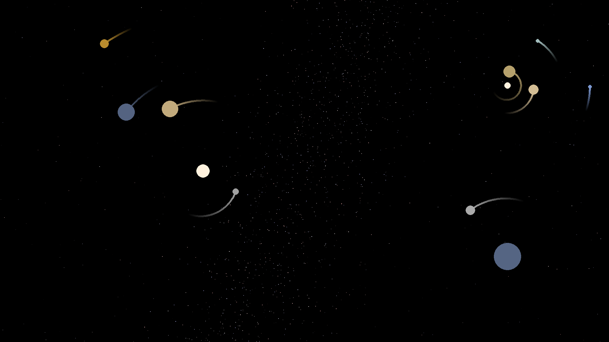

# Solar system simulated background

Watch the positions of the planets and the moon in real time!

Have a dynamic background which shows the real time location of the planets using NASA data! 



## How to use
1. Have python installed, you can test this by using the  `python` command in the Command Prompt
2. Make sure you have `pygame`, `certifi`, `numpy` and `dugong` installed via Command Prompt:
    ```
    > pip install pygame
    > pip install certifi
    > pip install numpy
    > pip install dugong
    ```

3. (optional) In the [setup script](python_scripts/setup.py), change verbose to `True` if you want a terminal to pop up everytime it loads the background.
4. Run the [setup script](python_scripts/setup.py). This will make sure your background will automatically change on startup.
5. (optional) Run [main.pyw](python_scripts/main.pyw) to generate a first background.

### Run scripts
If you have python installed and all the packages, you can run a script by running:
```
> python C:/path/to/dir/python_scripts/main.pyw
```
To get path_to_file, you can right-click the file in File Explorer -> Copy as Path which will save it to your clipboard.

## Data

This makes use of the [Horizons API](https://ssd-api.jpl.nasa.gov/doc/horizons.html) to gather the data
Unfortunately, this API only supports all bodies until 2200 A.D. so you can't use this while time traveling so far.

## Roadmap
* Shadows on the planets/moon
* Use images for the planets instead of plain colors.
* Support for other operating systems/desktop manager (low priority)